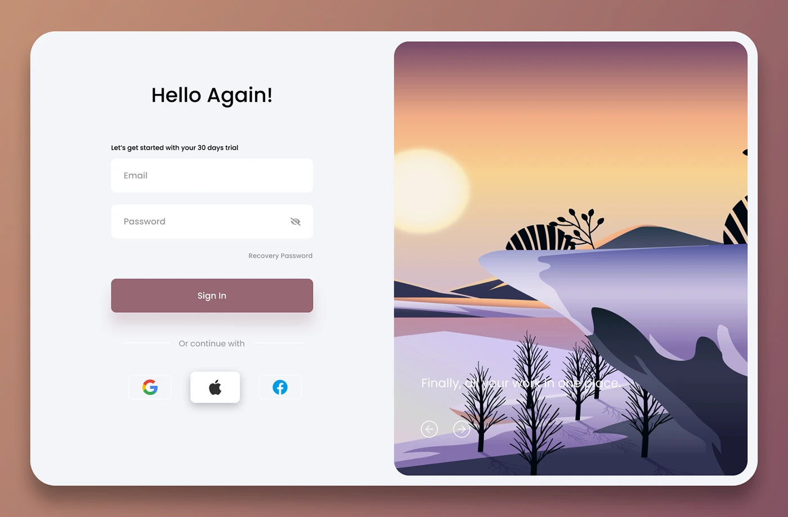

# Estudo da identidade aplicada no sistema

## Cores
    Nosso sistema utiliza as determinadas cores no determinado nível de hierarquia:

        1. Azul acinzentado #2d3250 
        2. Branco #ffffff 
        3. Azure acinzentado pastel #c4cacf 
        4. Amarelo apagado #d9c03d

    O azul é a cor primária do nosso sistema, pois simboliza confiança, segurança, profissionalismo e estabilidade,
    ela é usada nos principais itens e informações. Já o branco é a cor secundária pois passa  simplicidade, minimalismo 
    e clareza, ela é usada no fundo dos contêineres para diferenciar da cor do fundo e também é usadanas escritas que estão 
    em algo da cor azul. O azure simboliza equilíbrio e sofisticação sendo utilizado no fundo e em pequenos detalhes no sistema. 
    O amarelo simboliza energia, otimismo e criatividade, sendo utilizado como cor secundária para a logo e pequenos detalhes no sistema.

## Tipografia
    Utilizamos duas fontes em todo o sistema sendo elas em nível de hierarquia:

        1. 'Verdana', sans-serif
        2. 'Trebuchet MS', sans-serif

    A verdana foi utilizada para os títulos, pois é uma vonte sem serifa, ou seja com uma boa legibilidade e é mais larga dando mais 
    destaque a informação. Já a trebuchet ms foi selecionada para os textos, pois também é sem serifa, com boa legibilidade, mas não foi 
    seleciona para títulos por não ser larga.

## Estilo 
    Nosso site teve como foco o estilo minimalista moderno, com páginas claras e limpas que mesmo assim conseguem passar todas as informações
    necessárias com uma interface intuitiva.

## Proposta de layout
    Nossa proposta de layout foi de uma barra de navegação fixa, onde muda apenas em baixo dela de acordo com a paina do sistema, o fundo e os contêiner
    também são padrão, mudando apenas o formato e a distribuição dos itens dentros.

## Referências visuais
